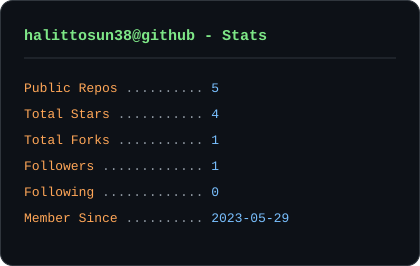
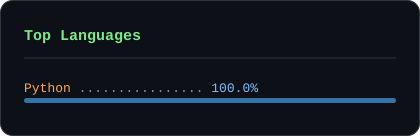
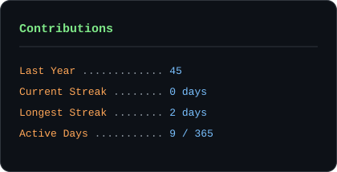

<!--
  halittosun38 GitHub profil README (neofetch tarzi)
  Butun kartlar bu repoda tutulur ve .github/workflows/cards.yml
  tarafindan her gun yeniden uretilir. Harici servis bagimliligi yoktur.
-->

### GitHub Istatistikleri (her gun otomatik guncellenir)

### Baglantilar

